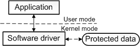

references:

- [What is a driver?](https://docs.microsoft.com/en-us/windows-hardware/drivers/gettingstarted/what-is-a-driver-)

## 何为驱动

所为驱动就是一个软件组件，它可以使得操作系统和设备互相进行通信

举个最简单的例子，一个应用程序需要从一个设备中读取数据，那么这个应用会调用由操作系统实现的方法，然后操作系统又会调用由驱动程序实现的方法

并不是所有的驱动都必须由开发这个硬件设备的厂商来编写

因为在大多数情况下，硬件都有固定的标准，只要按照这个标准进行驱动的开发就可以了

另外一点就是，并不是所有的驱动都是直接和设备打交道的

比如说一个IO请求，可能会存在多个驱动，他们共同组成一个driver stack来参与请求的处理

这些处于中间层的驱动并不直接和设备通信，他们只是在驱动之间传递请求

在上面的示意图中，function driver只有一个，他是负责直接和设备进行通信的驱动程序，其余的都是filter driver，他们可能只会对请求进行一些验证等操作

### 软件驱动

除了上面介绍的需要和硬件进行通信的驱动程序，还有一种驱动是不需要和任何硬件设备进行通信的

比如，你想要编写一个工具，这个工具可以访问到核心操作系统的数据结构，这种数据结构只能在内核模式下被访问到

你可以通过将你的工具分为两部分来进行实现，第一部分运行在用户模式下，负责提供用户接口，另一部分运行在内核模式，可以访问核心操作系统数据

运行在用户模式的叫做应用程序，运行在内核模式的叫做**软件驱动**

软件驱动不和任何硬件设备关联

软件驱动总是运行在内核模式下，编写软件驱动的原因就是需要访问仅在内核模式下可用的受保护的数据

相较于软件驱动，设备驱动并不总是需要访问内核模式下的数据和资源，因此有些设备驱动是运行在用户模式下的

## 驱动开发

### 环境搭建

host machine (dev machine, debugger)

- windows10 1903
- vs community 2019
- windows sdk
- windows wdk

target machine (debugee)

- 复制dev machine，然后按照下面的链接进行配置
- [https://docs.microsoft.com/en-us/windows-hardware/drivers/gettingstarted/provision-a-target-computer-wdk-8-1](https://docs.microsoft.com/en-us/windows-hardware/drivers/gettingstarted/provision-a-target-computer-wdk-8-1)

项目模板：[hello driver project](https://github.com/wqreytuk/windows_driver/tree/main/HelloDriverProject)

## [手把手教你debug windows驱动](https://docs.microsoft.com/en-us/windows-hardware/drivers/debugger/debug-universal-drivers---step-by-step-lab--echo-kernel-mode-#connectto)

[其中用到的一个示例项目](https://github.com/wqreytuk/windows_driver/tree/main/EchoKmdf)

[关于禁用driver签名](https://docs.microsoft.com/en-us/answers/questions/127698/disable-driver-signing-on-azure-windows-10-vm.html)
